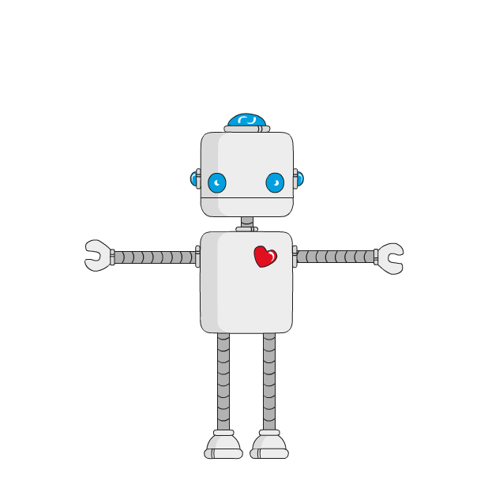

  
  

  
  

## Hi there! </h2>

### Abstract

- 💼 I'm currently internship  at **Núcleo de Pesquisa em Alimentos e Medicamentos – NUPLAM**.
- 🎓 Finishing **Mechatronic Engineering**. 
- 🔬 Researcher in **autonomous robotics**
- 💙 Interests: games 🎮 , dogs 🐕,  Robots 🤖~the crazy of the robots~🤖 .

 

### Find me around the web 🌎:

- 💼 Connecting and sharing professional updates on <a href="https://www.linkedin.com/in/willcr/">LinkedIn</a>.
